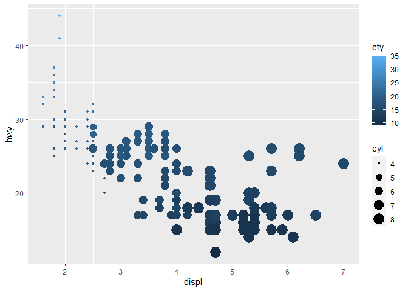

# RDS (R for Data Science) Solutions

I know the solutions to these problems already exist on the internet,
this is purely for my own benefit

## Chapter 3 Exercises

**Question 1** What’s gone wrong with this code? Why are the points not
blue?

    ggplot(data = mpg) + 
      geom_point(mapping = aes(x = displ, y = hwy, color = "blue"))

**Answer:** The color should be specified outside of the `aes()`
function call, for example

    ggplot(data = mpg) + 
      geom_point(mapping = aes(x = displ, y = hwy), color = "blue")

**Question 2** Which variables in mpg are categorical? Which variables
are continuous? (Hint: type ?mpg to read the documentation for the
dataset). How can you see this information when you run mpg?

**Answer:** On running `?mpg` you will see the data frame
specifications. There are 11 variables in total

*Continues variables*

-   displ  
-   cyl  
-   cty  
-   hwy

*Categorical variables*

-   manufacturer  
-   model  
-   year  
-   trans  
-   drv  
-   fl  
-   class

**Question 3:** Map a continuous variable to color, size, and shape. How
do these aesthetics behave differently for categorical vs. continuous
variables?

**Answer:** The following graph shows continuous variables mapped to
color and size (shape was not included because it simply errored).

    ggplot(data = mpg) +
      geom_point(mapping = aes(x = displ, y = hwy, color = cty, size = cyl))

The color and size seem to render as a specturm instead of a discrete
amount.
