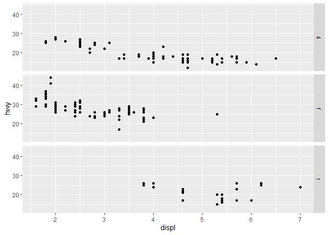

# RDS (R for Data Science) Solutions

I know the solutions to these problems already exist on the internet,
this is purely for my own benefit

## Chapter 3.2.4 Exercises

**Question 1:** Run ggplot(data = mpg). What do you see?

**Answer:** Not much.

    ggplot(data = mpg)

**Question 2:** How many rows are in mpg? How many columns?

**Answer:** 234 rows, 11 columns

    nrow(mpg)

    ## [1] 234

    ncol(mpg)

    ## [1] 11

**Question 3:** What does the `drv` variable describe? Read the help for
?mpg to find out.

**Answer:**
`the type of drive train, where f = front-wheel drive, r = rear wheel drive, 4 = 4wd`

**Question 4:** Make a scatterplot of hwy vs cyl.

**Answer:**

    ggplot(data = mpg) + 
      geom_point(mapping = aes(x = cyl, y = hwy))

**Question 5:** What happens if you make a scatterplot of class vs drv?
Why is the plot not useful?

**Answer:** Categorical variable vs categorical variable

    ggplot(data = mpg) + 
      geom_point(mapping = aes(x = drv, y = class))

## Chapter 3.3.1 Exercises

**Question 1** What’s gone wrong with this code? Why are the points not
blue?

    ggplot(data = mpg) + 
      geom_point(mapping = aes(x = displ, y = hwy, color = "blue"))

**Answer:** The color should be specified outside of the `aes()`
function call, for example

    ggplot(data = mpg) + 
      geom_point(mapping = aes(x = displ, y = hwy), color = "blue")

**Question 2** Which variables in mpg are categorical? Which variables
are continuous? (Hint: type ?mpg to read the documentation for the
dataset). How can you see this information when you run mpg?

**Answer:** On running `?mpg` you will see the data frame
specifications. There are 11 variables in total

*Continues variables*

-   displ  
-   cyl  
-   cty  
-   hwy

*Categorical variables*

-   manufacturer  
-   model  
-   year  
-   trans  
-   drv  
-   fl  
-   class

**Question 3:** Map a continuous variable to color, size, and shape. How
do these aesthetics behave differently for categorical vs. continuous
variables?

**Answer:** The following graph shows continuous variables mapped to
color and size (shape was not included because it simply errored).

    ggplot(data = mpg) +
      geom_point(mapping = aes(x = displ, y = hwy, color = cty, size = cyl))

The color and size seem to render on a spectrum instead of a discrete
amount.

**Question 4:** What happens if you map the same variable to multiple
aesthetics?

**Answer:** The graph below has color and size both mapped to `cty`.
Seems to work as expected…

    ggplot(data = mpg) +
      geom_point(mapping = aes(x = displ, y = hwy, color = cty, size = cty))

**Question 5:** What does the stroke aesthetic do? What shapes does it
work with? (Hint: use ?geom\_point)

**Answer:** “For shapes that have a border (like 21), you can color the
inside and outside separately. Use the stroke aesthetic to modify the
width of the border”

**Question 6:** What happens if you map an aesthetic to something other
than a variable name, like aes(color = displ &lt; 5)? Note, you’ll also
need to specify x and y.

**Answer:** The below graph shows what happens if you set
`color = displ < 5`. Since `displ < 5` is a function resulting a
boolean, it sets the colors of the graph accordingly

    ggplot(data = mpg) +
      geom_point(mapping = aes(x = displ, y = hwy, color = displ < 5))

## Chapter 3.5.1 Exercises

**Question 1:** What happens if you facet on a continuous variable?

**Answer:** Seems to work, but could end up creating a silly amount of
graphs that diminish the value of the visualization

    ggplot(data = mpg) + 
      geom_point(mapping = aes(x = displ, y = hwy)) + 
      facet_wrap(~ cty, nrow = 2)

**Question 2:** What do the empty cells in plot with facet\_grid(drv ~
cyl) mean? How do they relate to this plot?

**Answer:** The empty facets in this graph are combinations of drv and
cyl that have no data points. For example, the facet “5r” is empty
because there are not 5 cyl r drv cars

    ggplot(data = mpg) + 
      geom_point(mapping = aes(x = displ, y = hwy)) + 
      facet_grid(drv ~ cyl)

**Question 3:** What do the empty cells in plot with facet\_grid(drv ~
cyl) mean? How do they relate to this plot?

**Answer:** Use the `.` when you prefer to not facet in the rows or
columns dimension

    ggplot(data = mpg) + 
      geom_point(mapping = aes(x = displ, y = hwy)) +
      facet_grid(drv ~ .)

    ggplot(data = mpg) + 
      geom_point(mapping = aes(x = displ, y = hwy)) +
      facet_grid(. ~ cyl)

**Question 4:** What are the advantages to using faceting instead of the
color aesthetic? What are the disadvantages? How might the balance
change if you had a larger dataset?

**Answer:** Faceting helps show the graph for a specific category. If
there are too many categories color would be more appropriate

    ggplot(data = mpg) + 
      geom_point(mapping = aes(x = displ, y = hwy)) + 
      facet_wrap(~ class, nrow = 2)

**Question 5:** Read ?facet\_wrap. What does nrow do? What does ncol do?
What other options control the layout of the individual panels? Why
doesn’t facet\_grid() have nrow and ncol arguments?

**Answer:** nrow/ncol specifies the number of rows/columns. scales,
shrink, and other arguments exist as well. facet\_grid is a grid based
of the provided variables, so you can\`t specify the number of
rows/columns

**Question 6:** When using facet\_grid() you should usually put the
variable with more unique levels in the columns. Why?

**Answer:** This results in more space for the columns

## Chapter 3.6.1 Exercises

**Question 1:** What geom would you use to draw a line chart? A boxplot?
A histogram? An area chart?

**Answer:**

-   geom\_smooth = line
-   geom\_bar = barplot
-   geom\_histogram = histogram
-   geom\_area = area chart

**Question 2:** run the code in R and check your predictions

**Answer:** Ok, my predictions were just about right. I should be an
R-runtime in my spare time

    ggplot(data = mpg, mapping = aes(x = displ, y = hwy, color = drv)) + 
      geom_point() + 
      geom_smooth(se = FALSE)

    ## `geom_smooth()` using method = 'loess' and formula 'y ~ x'

**Question 3:** What does show.legend = FALSE do? What happens if you
remove it? Why do you think I used it earlier in the chapter?

**Answer:** Removes the legend from the side of the plot, probably to
remove clutter

**Question 4:** What does the se argument to geom\_smooth() do?

**Answer:** `se` stands for standard error. Setting it true, turns on
these gray areas around the line that represent the se

**Question 5:** Will these two graphs look different? Why/why not?

**Answer:** Nope. Same mappings, set globally or locally.

    ggplot(data = mpg, mapping = aes(x = displ, y = hwy)) + 
      geom_point() + 
      geom_smooth()

    ## `geom_smooth()` using method = 'loess' and formula 'y ~ x'

    ggplot() + 
      geom_point(data = mpg, mapping = aes(x = displ, y = hwy)) + 
      geom_smooth(data = mpg, mapping = aes(x = displ, y = hwy))

    ## `geom_smooth()` using method = 'loess' and formula 'y ~ x'

**Question 6** Recreate the R code necessary to generate the following
graphs.

**Answer:**

    ggplot(data = mpg, mapping = aes(x = displ, y = hwy)) + 
      geom_point() + 
      geom_smooth(se = FALSE)

    ## `geom_smooth()` using method = 'loess' and formula 'y ~ x'

    ggplot(data = mpg, mapping = aes(x = displ, y = hwy)) + 
      geom_point() + 
      geom_smooth(se = FALSE, mapping = aes(group = drv))

    ## `geom_smooth()` using method = 'loess' and formula 'y ~ x'

    ggplot(data = mpg, mapping = aes(x = displ, y = hwy, color = drv)) + 
      geom_point() + 
      geom_smooth(se = FALSE, mapping = aes(group = drv))

    ## `geom_smooth()` using method = 'loess' and formula 'y ~ x'

    ggplot(data = mpg, mapping = aes(x = displ, y = hwy)) + 
      geom_point(mapping = aes(color = drv)) + 
      geom_smooth(se = FALSE)

    ## `geom_smooth()` using method = 'loess' and formula 'y ~ x'

    ggplot(data = mpg, mapping = aes(x = displ, y = hwy)) + 
      geom_point(mapping = aes(color = drv)) + 
      geom_smooth(se = FALSE, mapping = aes(linetype = drv))

    ## `geom_smooth()` using method = 'loess' and formula 'y ~ x'

    ggplot(data = mpg, mapping = aes(x = displ, y = hwy)) + 
      geom_point(size = 4, color = "white") +
      geom_point(aes(color = drv))

